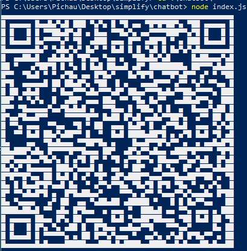
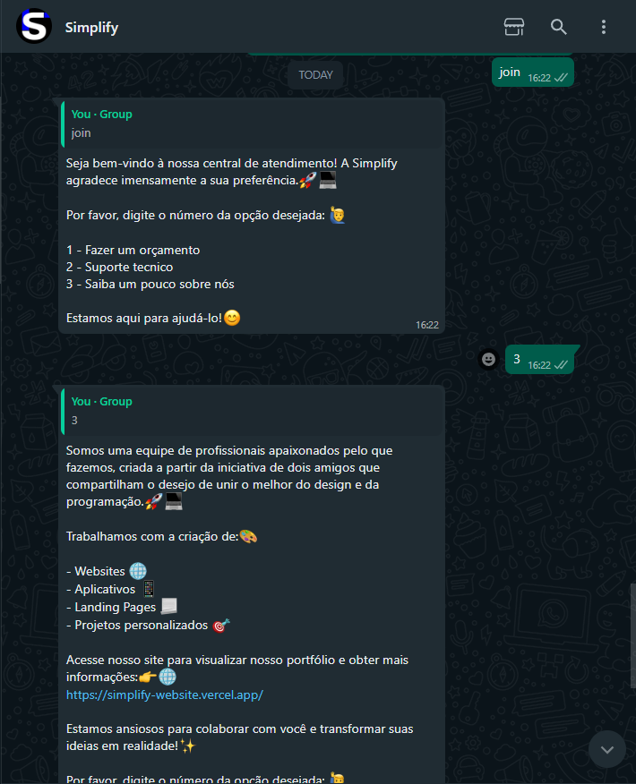
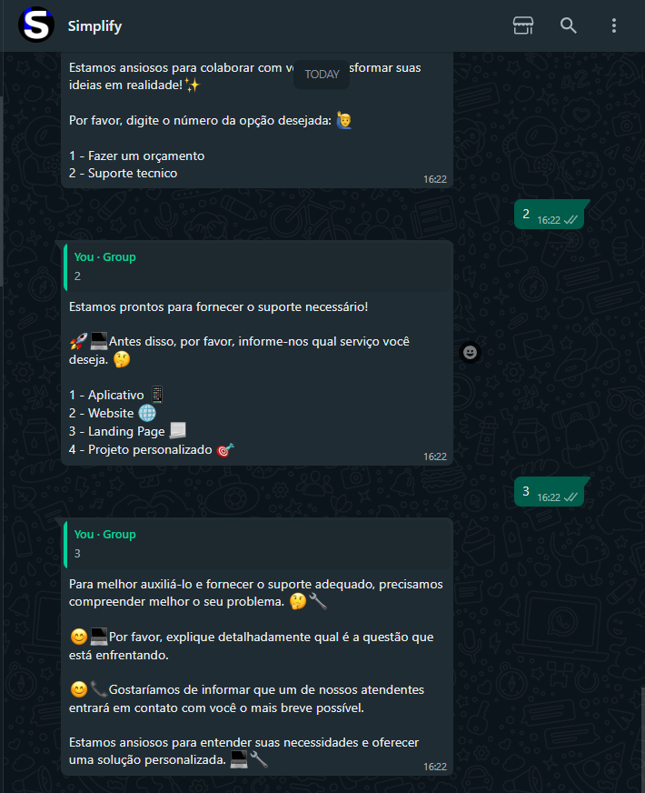

# Projeto de Atendimento por WhatsApp com WhatsApp-Web.js
Este é um projeto desenvolvido utilizando a biblioteca whatsapp-web.js para melhorar o atendimento por WhatsApp e torná-lo mais eficiente e direto quando um atendente entrar em contato.

# Como usar o projeto
Clone o repositório em sua máquina local:
git clone https://github.com/leoangonese/chatbot-whatsapp.git

# Instale as dependências necessárias:
npm install

# Execute o projeto:

node index.js
Aguarde até que o QR Code seja gerado no terminal.

Abra o WhatsApp no seu smartphone, clique em "Configurações" -> "WhatsApp Web" e escaneie o QR Code exibido no terminal.

Após a autenticação bem-sucedida, você poderá utilizar o chatbot para melhorar o atendimento aos seus clientes por WhatsApp.

# Screenshots
Exemplo de conversa com o chatbot.

# 🛠 Built With

-  Node JS

# Licença

[MIT](https://choosealicense.com/licenses/mit/)
